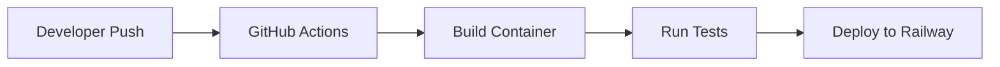

#Guide and Reports
> ##[Testkube and Katalon: Detailed Report](/test-cube.md)
---
# CI/CD and Containerization Guide

This guide explains the CI/CD pipeline and containerization setup for the DevPortfolio project.

## Table of Contents
- Container Setup
- CI/CD Pipeline
- Local Development
- Deployment

## Container Setup

### Dockerfile
The project uses Nginx to serve static files:

```dockerfile
# Use the official Nginx image
FROM nginx:alpine

# Copy the website files to Nginx's default directory
COPY . /usr/share/nginx/html

# Expose port 80
EXPOSE 80

# Start Nginx
CMD ["nginx", "-g", "daemon off;"]
```

### Build Process
The container build process includes:
1. Using Alpine Linux based Nginx for a small footprint
2. Copying all static assets (HTML, CSS, JS)
3. Configuring Nginx to serve on port 80

## CI/CD Pipeline

### GitHub Actions Workflow
Located in 

deploy.yml

:

```yaml
name: CI/CD Pipeline

on:
  push:
    branches:
      - main

jobs:
  build-and-deploy:
    runs-on: ubuntu-latest
    steps:
      - uses: actions/checkout@v3
      - uses: actions/setup-node@v3
        with:
          node-version: '14'
      - run: npm install
      - run: npm run build
      - name: Deploy to Railway
        env:
          RAILWAY_TOKEN: ${{ secrets.RAILWAY_TOKEN }}
        run: |
          npm install -g railway
          railway up --token $RAILWAY_TOKEN
```

### Build Steps
1. **Code Checkout**: Retrieves latest code
2. **Node Setup**: Configures Node.js environment
3. **Dependencies**: Installs required npm packages
4. **Build**: Compiles SCSS and minifies JS using 

gulpfile.js


5. **Deployment**: Pushes to Railway platform

## Local Development

### Prerequisites
- Docker Desktop
- Node.js
- Git

### Setup Instructions
1. Clone repository:
```bash
git clone https://github.com/Anas-Altaf/ci-cd-and-containerization.git
cd ci-cd-and-containerization
```

2. Install dependencies:
```bash
npm install
```

3. Run local development server:
```bash
docker build -t ci-cd-and-containerization .
docker run -d -p 8080:80 devportfolio
```

4. Visit `http://localhost:8080`

### Development Commands
```bash
# Watch for SCSS/JS changes
npm run watch

# Build production assets
npm run build
```

## Deployment

### Railway Platform
The project is configured for deployment to Railway:

1. **Setup**:
   - Connect GitHub repository to Railway
   - Add `RAILWAY_TOKEN` to GitHub Secrets

2. **Deployment Flow**:
   - Push to main branch triggers workflow
   - GitHub Actions builds container
   - Railway pulls and deploys container

### Alternative Deployment
The Docker image can also be deployed to:
- AWS Elastic Beanstalk
- Google Cloud Run
- Azure App Service

## Architecture



## Build Process Details

The 

gulpfile.js

 handles asset compilation:
- SCSS compilation with autoprefixer
- JavaScript transpilation and minification
- Source maps generation

This setup ensures a consistent build process whether running locally or in CI/CD.

For additional help or configuration options, check the 
testing.md file.
---
##Participants
- [Umair Altaf  (22F-3737)](https://github.com/umairaltaf982)

- [Anas Altaf  (22F-3639)](https://github.com/Anas-Altaf)